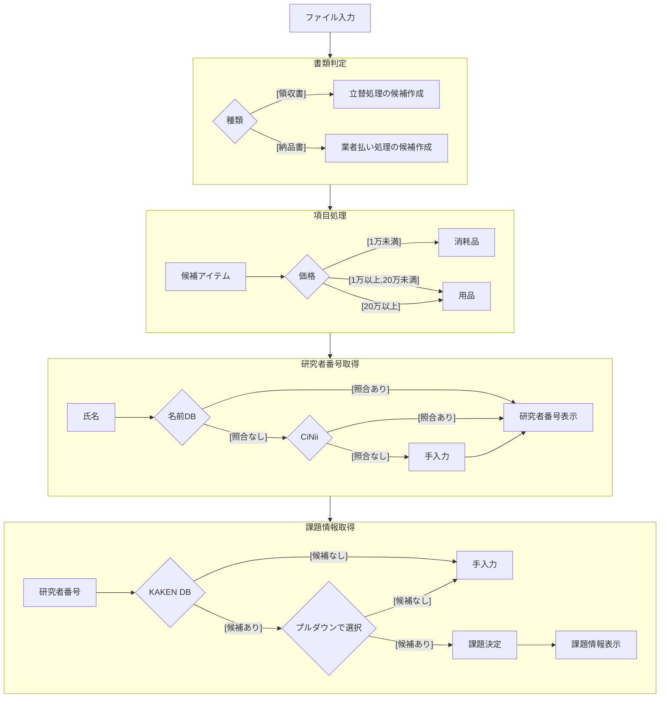

# 科研費自動化プロジェクト

<!-- {{{ ## 概要 -->
## 概要
領収書をOCRして, 科研用の処理を自動化するシステム
科研の処理は, 物品購入以外にも出張資料や, 業務委託などもありますが,
まずは物品購入処理の自動化をここで目指します.

1. 領収書からの項目と金額, 日時並びに利用者の読み込み
1. 利用者の記載がない場合は, 別途入力させた上で, 利用する科研費の選択
1. 項目ごとに, メーカー, 品名, 型番, 金額, 個数を読み込む
1. 品名, メーカー, 型番, 金額, 想定費目をUIに表示させる.
1. ユーザーが上記のUIを確認し, 追加入力+訂正
<!-- }}} -->

<!-- {{{ ## 処理概要 -->
## 処理概要



<!-- {{{ ### 補足 -->
### 補足

+ 書籍, ライセンス料金（業務委託）については, 現行では触れないこととします.
+ 領収書か請求書と, 科研の処理が１対１対応している事が望ましいとします.
+ 購入に際して, 金額の確認が不充分な場合があるので,
単一PDFに対して, 複数の出力を許容します.
+ 上記の姿勢から, 複数PDFに対して, 単一の出力は現状許容しない方向で検討しています.
<!-- }}} -->

<!-- }}} -->

<!-- {{{ ## load map -->
## load map
+ 先ずは, 生協の請求書のスキャンとヨドバシの領収書データに対応する
+ localでデモのjsonファイルから,
処理に必要なjsonファイルを作成する.
+ 上記に合致したUIを作る.
+ DBをKakenDBから取得したい
+ OCRのapiと接続する
+ ローカルにおくDBなどをサーバーサイドへ移行
+ 科研の新システムが公開され次第,
出力をそちらに対応させる
<!-- }}} -->

<!-- {{{ ## OCR関連 -->
## OCR関連
OCRは現在 Gemini Flash Latestを利用しています.
Promptは以下

+ 単価はGeminiが判断できました.
+ 現在は内税表記のみを対象としています.

```
領収書か納品書の情報を解析し、購入項目ごとに以下の形式でJSONに構造化してください.
ただし、以下の処理を施してください.
+ 金額の部分はカンマがあれば除いてください
+ 金額が0の項目は無視してください

{
  "title": "領収書タイトル",
  "issuer": "発行者情報",
  "receiver_group": "受領者所属",
  "receiver_group": "受領者氏名(敬称、空白は除く)",
  "total_amount": "合計金額",
  "payment_date": "支払日",
  "items": [
    {
      "product_name": "製品名(型番は抜く) ",
      "provider": "メーカー",
      "model": "型番"
      "unite_price": "単価",
      "total_price": "金額"
      "number": "個数",
      "delivery_date": "発送日"
    },
    ...
  ]
}
```
<!-- }}} -->

## DB関連
DBの構成案は以下です.
+ research.dbとして仮置きしてます

<!-- {{{ ### table: allocations -->
### table: allocations
```sql
CREATE TABLE allocations (
    ID INTEGER PRIMARY KEY AUTOINCREMENT,
    PN TEXT NOT NULL,
    PI INTEGER NOT NULL,
    CI INTEGER,
    distributed_campus TEXT,
    distributed_location TEXT,
    installed_campus TEXT,
    installed_location TEXT
);
```

+ PN: Projects Number
+ PI: Principle Investigator
+ CI: Co-Investigator
+ 若手や学振のように, 単独の研究用の科研費があるので, 分担者はNULLを許容します.
+ 分担者は, 利用者が分担者の場合の利用を想定する. 複数いる場合は,
人数分レコードを増やす.
+ 初期は手入力で行ってもらってもいいですが,
ご入力をさける為, KAKEN apiの利用を念頭に置きたいと考えています.
<!-- }}} -->

<!-- {{{ ### resarchers -->
### resarchers
```sql
CREATE TABLE resarchers (
    number INTEGER PRIMARY KEY,
    name TEXT NOT NULL
);
```


+ 可能ならば, Kaken apiを利用して, 研究者番号から検索をかけたい.
+ OCRの混乱回避のため, 姓名は区別して登録しない方向で検討
+ アルファベットの場合は, 姓名の最初を大文字とし, 空白は利用しない方向で検討
+ ミドルネームなどは, 書類上対応しない方向で検討
+ 苗字のみの書類は, 対応しない方向で検討
<!-- }}} -->

<!-- {{{ ### projects -->
### projects
```sql
CREATE TABLE projects (
    number TEXT PRIMARY KEY,
    title TEXT NOT NULL,
    name TEXT NOT NULL
);
```
<!-- }}} -->


## 科研費の処理系

+ すべて内税で処理
+ １万円未満は, 消耗品を候補とします.
+ 1万円以上, 20万円未満は, 用品を候補とします.
+ 20万円以上は, 備品として処理します.
+ 実際は, 金額だけではなく, 使い切りのものは消耗品,
什器は備品となるので, その都度選べるようにしたいです.


<!-- {{{ ## index.html のボタン挙動について -->
## index.html のボタン挙動について

本プロジェクトの `index.html` に含まれる各ボタンの ID と、それに紐づくスクリプトについて記述します。

### JSON関連ボタン

| ボタンID      | 説明                                       | 紐づくスクリプト |
|--------------|--------------------------------|----------------|
| `Json-import` | JSONファイルをインポートし、フォームへ反映 | `json_imp.js` |
| `Json-export` | フォームの内容をJSONファイルとして出力 | `json_exp.js` |

### PDF関連ボタン

| ボタンID      | 説明                                       | 紐づくスクリプト |
|--------------|--------------------------------|----------------|
| `pdf-import` | `test.json` の情報をフォームに転記 | `pdf_demo.js` |
| `pdfUpload` | PDFファイルをアップロードしてプレビュー | `pdf_preview.js` |

### 研究者情報・課題情報関連ボタン

| ボタンID                  | 説明                                      | 紐づくスクリプト |
|--------------------------|--------------------------------|----------------|
| `asign-info-from-db`     | 課題番号をDBから取得し、フォームへ反映 | `db_fetch.js`  |
| `db-updated`             | フォームの内容をDBへ更新          | `db_update.js` |
<!-- }}} -->

<!-- {{{ ## API -->
## API Documentation

### 概要
この API は科研費データベースと連携し、研究者情報や研究課題情報を取得する機能を提供します。
サーバーは `Express.js` を使用して構築され、データベースとして `SQLite` を使用しています。

### 環境変数
この API を実行するには `.env` ファイルを作成し、以下の環境変数を設定してください。

```
PORT=3000
KAKENAPI=your_api_key_here
```

### エンドポイント一覧

#### 研究者関連エンドポイント

##### 研究者番号を取得
**GET `/getResearcherNumber`**

**クエリパラメータ:**
- `name`: 研究者氏名（必須）

**レスポンス:**
- 成功: `{ researcherNumber: "123456" }`
- 失敗: `{ error: "研究者番号が見つかりませんでした。" }`

##### 研究者名を取得
**GET `/getResearcherName`**

**クエリパラメータ:**
- `researcherNumber`: 研究者番号（必須）

**レスポンス:**
- 成功: `{ 研究者: "田中太郎" }`
- 失敗: `{ 研究者: "DB未登録" }`

##### 研究者番号を外部APIから検索
**GET `/searchResearcherNumber`**

**クエリパラメータ:**
- `name`: 研究者氏名（必須）

**レスポンス:**
- 成功: `{ totalResults: 1, researcherIds: ["123456"] }`
- 失敗: `{ error: "API取得エラーが発生しました。" }`

---

#### 研究課題関連エンドポイント

##### 課題番号から研究者の課題情報を取得
**GET `/getProjectsByResearcherNumber`**

**クエリパラメータ:**
- `researcherNumber`: 研究者番号（必須）

**レスポンス:**
- 成功: `{ projects: ["K12345", "K67890"] }`
- 失敗: `{ error: "該当する課題番号が見つかりませんでした。" }`

##### 課題番号から課題情報を取得
**GET `/getProject`**

**クエリパラメータ:**
- `projectNumber`: 課題番号（必須）

**レスポンス:**
- 成功: `{ 課題種別: "基盤研究(A)", 課題名: "先端AI技術の研究" }`
- 失敗: `{ error: "DB未登録" }`

##### 課題番号から課題の配分情報を取得
**GET `/getAllocation`**

**クエリパラメータ:**
- `projectNumber`: 課題番号（必須）

**レスポンス:**
- 成功:
```json
{
  "納品キャンパス": "深草",
  "納品先": "3号館",
  "設置キャンパス": "瀬田",
  "設置先": "5号館",
  "PI": "123456",
  "CI": "789012"
}
```
- 失敗: `{ error: "DB未登録" }`

---

#### その他

##### サーバー起動方法
```
npm install
node server.js
```
サーバーが `http://localhost:3000` で起動します。

---

この API は科研費データベースを利用した研究者および課題管理を簡単に行えるように設計されています。


<!-- }}} -->

## Discussion
### UI
+ UIに処理上のエラーがある場合は, ダイアログメッセージを出したいです.

+ UIに提出できない状況である場合は, 警告をだしたいです.

+ 分担の場合は, 代表者の表示もした方がよい気がしますが,
分担でない場合は, いちいち表示させたくないと感じています.
UIの設計にいいアイディアはありますか?

### OCR
+ 生協とヨドバシは内税表記なので問題ないですが,
外税表記の対応は要件等となります.
+ AIに金額を含めた項目判定を載せてもいいかもしれませんが,
例外処理は事務と事前にかけあってほしいので,
丁寧に対応しすぎない方がいいかもしれません.

### DB
+ sqlite3でもいいですか.
+ アルファベット表記の対応はこれでいいでしょうか.
+ 苗字のみの領収書は, 手書きを除いて少ない気がしますが,
苗字のみの対応も必要でしょうか.
