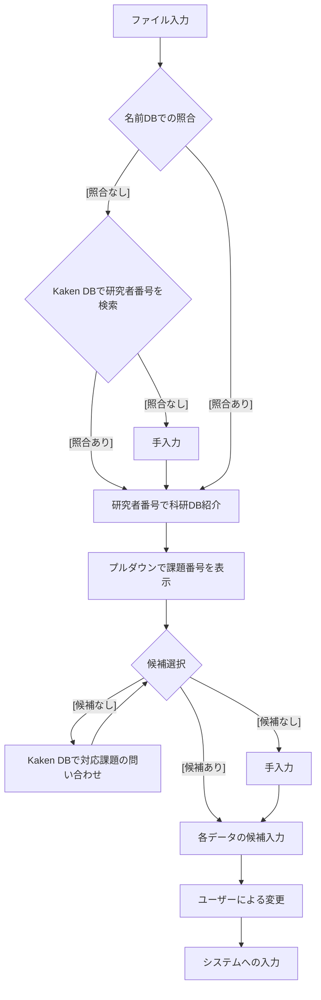

# 科研費自動化プロジェクト

## 概要
領収書をOCRして, 科研用の処理を自動化するシステム
科研の処理は, 物品購入以外にも出張資料や, 業務委託などもありますが,
まずは物品購入処理の自動化をここで目指します.

1. 領収書からの項目と金額, 日時並びに利用者の読み込み
1. 利用者の記載がない場合は, 別途入力させた上で, 利用する科研費の選択
1. 項目ごとに, メーカー, 品名, 型番, 金額, 個数を読み込む
1. 品名, メーカー, 型番, 金額, 想定費目をUIに表示させる.
1. ユーザーが上記のUIを確認し, 追加入力+訂正

## 処理概要



### 補足

+ 書籍, ライセンス料金（業務委託）については, 現行では触れないこととします.
+ 領収書か請求書と, 科研の処理が１対１対応している事が望ましいとします.
+ 購入に際して, 金額の確認が不充分な場合があるので,
単一PDFに対して, 複数の出力を許容します.
+ 上記の姿勢から, 複数PDFに対して, 単一の出力は現状許容しない方向で検討しています.

## load map
+ 先ずは, 生協の請求書のスキャンとヨドバシの領収書データに対応する
+ localでデモのjsonファイルから,
処理に必要なjsonファイルを作成する.
+ 上記に合致したUIを作る.
+ DBをKakenDBから取得したい
+ OCRのapiと接続する
+ ローカルにおくDBなどをサーバーサイドへ移行
+ 科研の新システムが公開され次第,
出力をそちらに対応させる

## OCR関連
OCRは現在 Gemini Flash Latestを利用しています.
Promptは以下

+ 単価はGeminiが判断できました.
+ 現在は内税表記のみを対象としています.

```
領収書か納品書の情報を解析し、購入項目ごとに以下の形式でJSONに構造化してください.
ただし、以下の処理を施してください.
+ 金額の部分はカンマがあれば覗いてください
+ 金額が0の項目は無視してください 

{
  "title": "領収書タイトル",
  "issuer": "発行者情報",
  "receiver_group": "受領者所属",
  "receiver_group": "受領者氏名(敬称、空白は除く)",
  "total_amount": "合計金額",
  "payment_date": "支払日",
  "items": [
    {
      "product_name": "製品名(型番は抜く) ",
      "provider": "メーカー",
      "model": "型番"
      "unite_price": "単価",
      "total_price": "金額"
      "number": "個数",
      "delivery_date": "発送日"
    },
    ...
  ]
}
```

## DB関連
DBの構成案は以下です.
+ sqlite3の利用を検討しています.

### 科研DB
| ID | 課題番号 | 科研費種別      | 代表者（研究者番号) | 分担者（研究者番号) |
|----|--------------|----------------|---------------------|---------------------|
|1| 24Kxxxxx | 若手研究 | aaaa | Null |
|2| 24Hyyyyy | 基盤(S) | bbbb | aaaa |
|3| 24Hyyyyy | 基盤(S) | bbbb | cccc |

+ 若手や学振のように, 単独の研究用の科研費があるので, 分担者はNULLを許容します.
+ 分担者は, 利用者が分担者の場合の利用を想定する. 複数いる場合は,
人数分レコードを増やす.
+ 初期は手入力で行ってもらってもいいですが,
ご入力をさける為, Kaken apiの利用を念頭に置きたいと考えています.

### 名前DB

| 研究者番号(id) | 氏名 |
| -- | -- |
| aaaa | 龍谷太郎 |
| bbbb | 山下よしゑ |
| cccc | MarioRossi |

+ 可能ならば, Kaken apiを利用して, 研究者番号から検索をかけたい.
+ OCRの混乱回避のため, 姓名は区別して登録しない方向で検討
+ アルファベットの場合は, 姓名の最初を大文字とし, 空白は利用しない方向で検討
+ ミドルネームなどは, 書類上対応しない方向で検討
+ 苗字のみの書類は, 対応しない方向で検討

## 科研費の処理系

+ すべて内税で処理
+ １万円未満は, 消耗品を候補とします.
+ 1万円以上, 20万円未満は, 用品を候補とします.
+ 試薬や実験キットの扱いは, 手入力で訂正としています.

## Discussion
### UI
+ UIとしては, teamsの業務アプリに候補が入力された状態が楽かなと感じています.

+ UIに処理上のエラーがある場合は, ダイアログメッセージを出したいです.

+ UIに提出できない状況である場合は, 警告をだしたいです.

+ 分担の場合は, 代表者の表示もした方がよい気がしますが,
分担でない場合は, いちいち表示させたくないと感じています.
UIの設計にいいアイディアはありますか?

### OCR
+ 生協とヨドバシは内税表記なので問題ないですが,
外税表記の対応は要件等となります.
+ 消耗品化どうかの判断を任せてもいいかもしれません.

### DB
+ sqlite3でもいいですか.
+ アルファベット表記の対応はこれでいいでしょうか.
+ 苗字のみの領収書は, 手書きを除いて少ない気がしますが,
苗字のみの対応も必要でしょうか.
